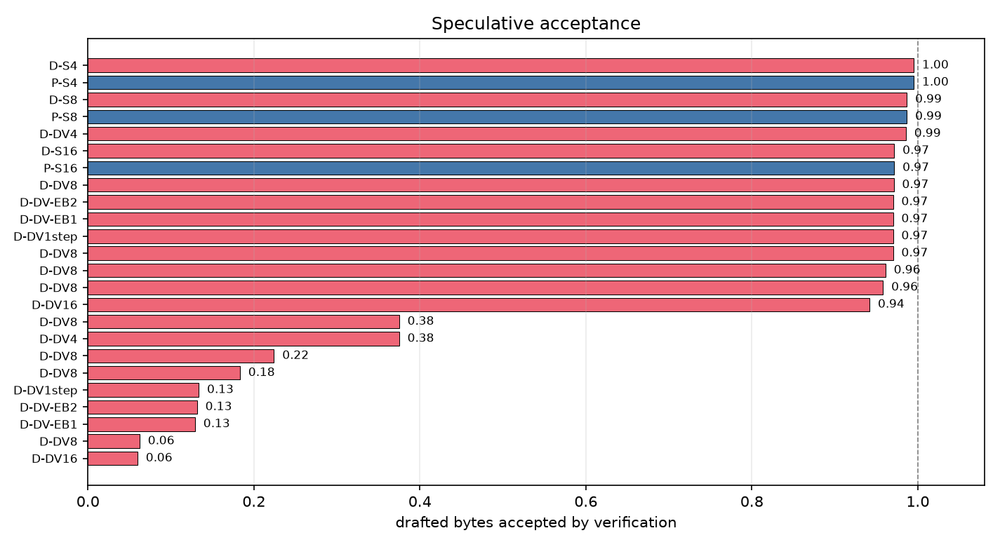
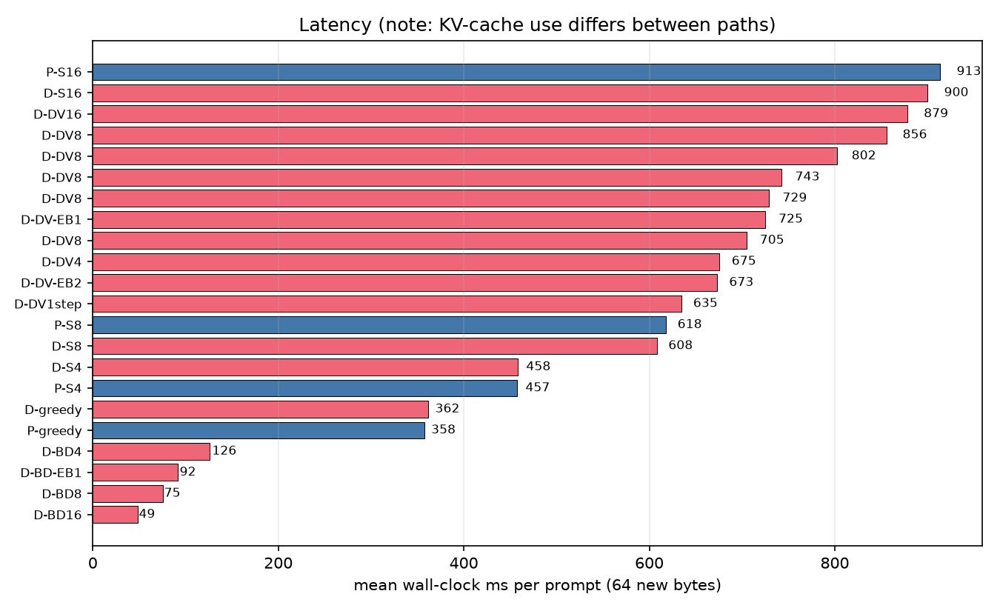

# fBLT

[](https://github.com/iiEliJas/fBLT/actions/workflows/ci.yml)
[](LICENSE)

Fast Byte Latent Transformer in pure C and CUDA. A byte-level language model with no tokenizer, built for code completion and small LLMs.

Based on two papers from Meta:
- [Byte Latent Transformer](https://arxiv.org/abs/2412.09871) - Byte modeling with entropy-based dynamic patching. Matches token-based LLM scaling, no vocabulary needed.
- [Fast Byte Latent Transformer](https://arxiv.org/abs/2605.08044) - Faster inference with diffusion decoding and self-speculation.

## How it works

Five-stage pipeline:

1. **Entropy Model**: small byte-level LM that predicts per-byte entropy used for patching

2. **Patcher**: chops the byte stream into patches using entropy thresholds (rule-based so no learning)

3. **Local Encoder**: tiny transformer that compresses byte patches into embeddings, using hash n-gram embeddings to recognize byte patterns without a vocabulary

4. **Patch Transformer**: the main model. Block-causal attention over patches.

5. **Local Decoder**: tiny transformer that expands patches back to bytes, with optional self-speculation

## Quickstart

```bash
pip install -e .                    # install fblt package + entry points
make CUDA=1 train-blt-d infer       # build C binaries (drop CUDA=1 for CPU-only)

# Train a tiny model (debug config, ~10 steps)
fblt-train --config configs/train/debug.yaml --backend cpu

# Generate text from the trained checkpoint (auto-shapes from resolved_config.yaml)
CKPT=$(ls runs/debug-*/checkpoint.fblt | head -1)
fblt-infer --checkpoint "$CKPT" --backend cpu --prompt "int main"
```

The debug config trains a small model in seconds. For production training, use `configs/train/production.yaml` with CUDA.

## Build

```bash
make test         # build + run C test suite
make train-blt-d  # build train_blt_d executable for training
make main         # build main executable
make info         # show build config
make clean        # remove obj/, bin/
make help         # show all targets

python3 tests/test_config.py        # Python config tests
python3 tests/test_entrypoints.py   # Python entry-point tests
```

Default is `gcc -O2 -std=c99 -Wall -Wextra`. Change it:

```bash
make CC=clang CFLAGS="-O3 -std=c99 -Wall"
```

CUDA: `make CUDA=1 <target>` compiles `.cu` files with nvcc, outputs to `obj-cuda/` and `bin-cuda/`.

### Python setup

```bash
pip install -e .    # installs fblt package + fblt-train / fblt-infer entry points
```

Requires Python >= 3.9.

## Layout

```
csrc/
  core/               Core: tensor, memory, backend, allocator, JSON, tools
  ops/                Op signatures + CPU/CUDA implementations
  models/             Model components
  infer/              Inference: KV cache, speculation, block generation

fblt/                 Python package
  __init__.py
  train.py            Training entry point (fblt-train)
  infer.py            Inference entry point (fblt-infer)
  _binary.py          Binary path resolution
  _config.py          TrainConfig / InferConfig dataclasses, YAML loader
  _runner.py          Subprocess runner with live streaming
  scripts/            Utilities (bench_plots, bench_report, gen_configs, prep_corpus)

configs/
  train/              Training YAML configs (production, debug)
  infer/              Inference YAML configs (greedy, selfspec, blockdiff, blockdv)
  ablations/          Ablation sweep configs (JSON)

tests/                Test suite (C + Python)
bench/                Benchmarks
run/                  C entry points (train_blt_d.c, infer.c, etc.)
data/                 Sample data (tests, training, etc.)
```

## Training configuration

The production config for 2.97M-parameter BLT-D training (embed=192, hidden=384, 2/2/2 layers):

```bash
fblt-train --config configs/train/production.yaml --backend cuda
```

The wrapper creates a run directory under `runs/`, writes a `resolved_config.yaml` with the full config, and calls `train_blt_d`. All `--override key=value` flags are passed through, and `--backend` is always required on the command line (never in YAML).

The underlying C binary can still be called directly:

```bash
./bin-cuda/train_blt_d --backend cuda \
  --embed 192 --hidden 384 --layers 2 \
  --steps 40000 --lr 0.05 --lr-decay 1 \
  --mask-warmup 33200 --mask-scale 0.3 \
  --t-min 0.1 --t-warmup-hi 0.25 --t-hi-start 0.8 \
  --cross-attn all --optimizer sgd \
  --diffusion 1 --block-size 4 --window 48 \
  --save-weights runs/my_checkpoint.fblt
```

This is what `fblt-train` actually calls. Use it when you need to skip the wrapper or debug the binary directly.

**What was tested and found** (see [ABLATIONS.md](docs/ABLATIONS.md) for details):

| Setting | Value | Finding |
|---|---|---|
| Step budget | 40k | Safe convergence floor; masked acc > 0.99 across seeds |
| Mask-warmup | 83% of steps | 95% is a minor improvement, not required |
| Decoder depth | 2 layers | Deeper decoder (3-4 layers) doesn't help |
| Encoder depth | 2 layers | Deeper encoder shows instability |
| Cross-attn | all or last | xlast is ~15% faster, quality indistinguishable |
| High-t warmup | on | -0.33 BPB improvement, no instability |
| Mask-late | off | No benefit found |

CUDA delivers **76x training speedup** and **34x generation speedup** over CPU at production config (E=192, H=384, 2.97M params). CPU baseline is single-threaded naive loops. Matmul fp32 hits **6.4 TFLOP/s** on the desktop RTX 4060 (**42.4% MFU** against the 15.11 TFLOP/s spec peak). BF16 mixed-precision matmuls reach **~20 TFLOP/s** (~3x the fp32 rate).

```bash
# Raw binary (same as fblt-train above)
./bin-cuda/train_blt_d --backend cuda --embed 192 --hidden 384 \
  --steps 40000 --lr 0.05 --mask-scale 0.3 \
  --t-warmup-hi 0.25 --t-hi-start 0.8
```

Full results: [BENCHMARKS.md](docs/BENCHMARKS.md).

**OPEN items:** Seed-dependent non-determinism from CUDA atomics. Acceptance-rate root cause at this scale is unknown.

## Inference

### Generating text from a checkpoint

Use `fblt-infer` to generate text from a trained model:

```bash
fblt-infer --checkpoint runs/debug_checkpoint.fblt --backend cpu \
  --config configs/infer/greedy.yaml --prompt "int main"
```

If the checkpoint was produced by `fblt-train`, the wrapper auto-detects model dimensions from `resolved_config.yaml`. So no need to pass `--embed`, `--hidden`, etc. manually. For checkpoints not produced by the wrapper, pass shape flags via `--override`:

```bash
fblt-infer --checkpoint my_model.fblt --backend cpu \
  --override embed=192 --override hidden=384 \
  --override enc-layers=2 --override glob-layers=2 --override dec-layers=2 \
  --prompt "def "
```

Inference methods: `greedy` (default), `selfspec`, `blockdiff`, `blockdv`. See `configs/infer/` for example YAML configs for each method.

### Benchmarking (research tool)

`infer_bench` is a separate research/benchmarking tool that compares inference methods and writes metrics to `bench/results.jsonl`.

```bash
make bench-infer                       # needs runs/*_40k.fblt checkpoints
python3 fblt/scripts/bench_plots.py    # writes graphs/*.png
```

Three inference modes, benchmarked on the 2.97M-param checkpoint:

- **BLT-S**: draft k bytes with decoder-only passes, verify with one full forward. Byte-identical output, fewer encoder/global passes.
- **BLT-D**: decoder generates a whole block of future bytes in parallel from masked states. Cheapest per byte, but drafts drift.
- **BLT-DV**: BLT-D drafts, then the model verifies them. Output matches greedy so the draft just makes it cheaper.

**Headline finding:** At 2.97M params, all verified inference methods (BLT-S, BLT-DV) cost *more* memory bandwidth than greedy. BLT-DV acceptance rates (1.6-5.2%) are 18-42x lower than the paper's 3B results. Root cause likely because of the 340x scale gap. See [BENCHMARKS.md](docs/BENCHMARKS.md) for full results.


*Drafted-byte acceptance rate by method, 2.97M-param checkpoint. BLT-S k=4 leads at 31%, declining sharply with k. BLT-DV variants cluster at 2-25%.*


*Mean wall-clock ms per prompt (64 new bytes). KV-cache usage differs between inference paths, so these are rough wall-clock numbers, not a clean comparison.*

## Ablation sweeps

Architecture and schedule ablations at 2.97M parameters (embed=192, hidden=384, 2/2/2 layers) on ~67 MB of C source code. Each axis tested with 3-6 seeds at 40k steps.

| Axis | Finding |
|---|---|
| Decoder depth | Deeper decoder (3-4 layers) doesn't help so 2/2/2 is optimal |
| Encoder depth | Deeper encoder (3/2/2) is harmful so 2 layers is best |
| Cross-attn | base (all) and xlast (last) tied at 83% warmup - xlast ~15% faster |
| High-t warmup | Improves BPB by 0.33 (2.7x noise floor), no instability |
| Mask-late | No benefit found |
| Step budget | 40k is safe convergence floor (cliff sits somewhere at 25k-35k) |

Full tables, raw numbers, and production config: [ABLATIONS.md](docs/ABLATIONS.md).

## TODO

**Done:**
- Tensor and memory system (arena allocator, shapes, strides)
- Backend dispatch (CPU/CUDA abstraction)
- Core ops on CPU + CUDA (elementwise, matmul, softmax, attention, etc.)
- Entropy model, patcher
- Attention (causal, cross-attention, custom masks)
- Full test harness (unit, integration, golden files)
- Hash n-gram embeddings
- Local encoder + decoder
- Patch transformer (global model)
- End-to-end forward pass
- FLOP counting and profiling
- Ablation sweeps (BPB tables)
- CUDA backend
- Training configuration validation (2.97M params, 40k steps)
- Inference re-verification (acceptance rates, bandwidth analysis)
- Python wrapper scripts (fblt-train, fblt-infer) with YAML config loading
- Config dataclasses (TrainConfig, InferConfig) with CLI override merging
- Auto shape-matching from resolved_config.yaml
- Run-directory management with resolved config snapshots
- YAML configs for training and inference

**Todo:**
- Multi-GPU / larger-scale training runs
- Windows and MacOS support
- Inference improvements
- Test acceptance rates on larger checkpoints (root-cause investigation)

## Docs

- [BENCHMARKS.md](docs/BENCHMARKS.md) - Full benchmark report
- [ABLATIONS.md](docs/ABLATIONS.md) - Ablation sweep results
- [CLI_REFERENCE.md](docs/CLI_REFERENCE.md) - CLI commands for training and inference

## Contributing

See [CONTRIBUTING.md](CONTRIBUTING.md) for branch policy, code style, and PR guidelines.

## References

If you build on this work, please consider citing the foundational Meta papers:

```bibtex
@misc{pagnoni2024bytelatenttransformerpatches,
      title={Byte Latent Transformer: Patches Scale Better Than Tokens}, 
      author={Alessandro Pagnoni and Ramakanth Pasunuru and Pedro Rodriguez and others},
      year={2024},
      eprint={2412.09871},
      archivePrefix={arXiv},
      primaryClass={cs.CL}
}

@misc{kallini2026fastbytelatenttransformer,
      title={Fast Byte Latent Transformer}, 
      author={Julie Kallini and Artidoro Pagnoni and Tomasz Limisiewicz and Gargi Ghosh and Luke Zettlemoyer and Christopher Potts and Xiaochuang Han and Srinivasan Iyer},
      year={2026},
      eprint={2605.08044},
      archivePrefix={arXiv},
      primaryClass={cs.CL}
}

## License

[Apache 2.0](LICENSE)
