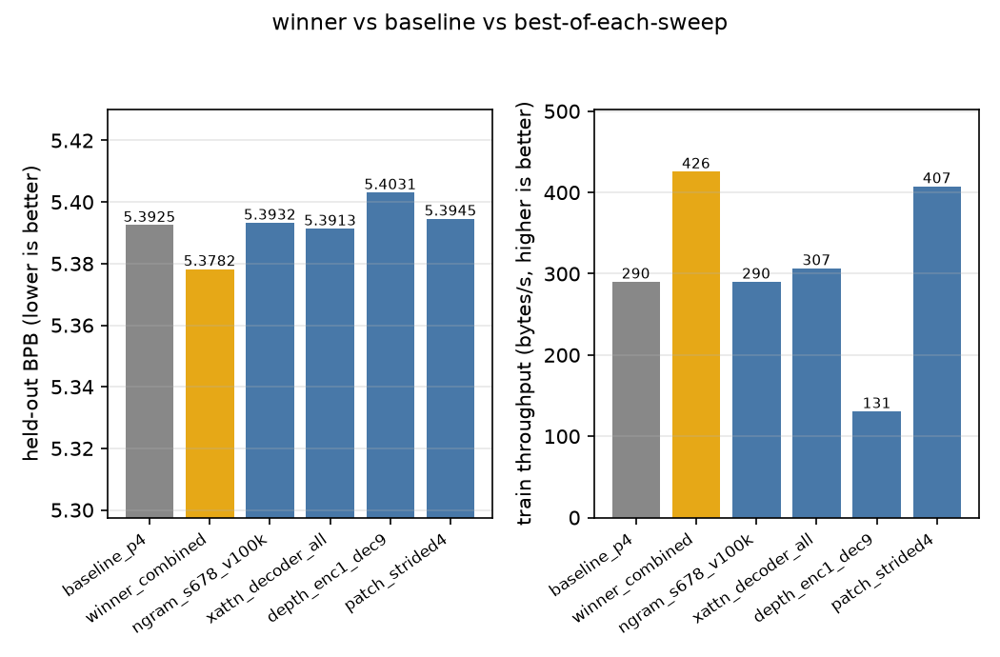
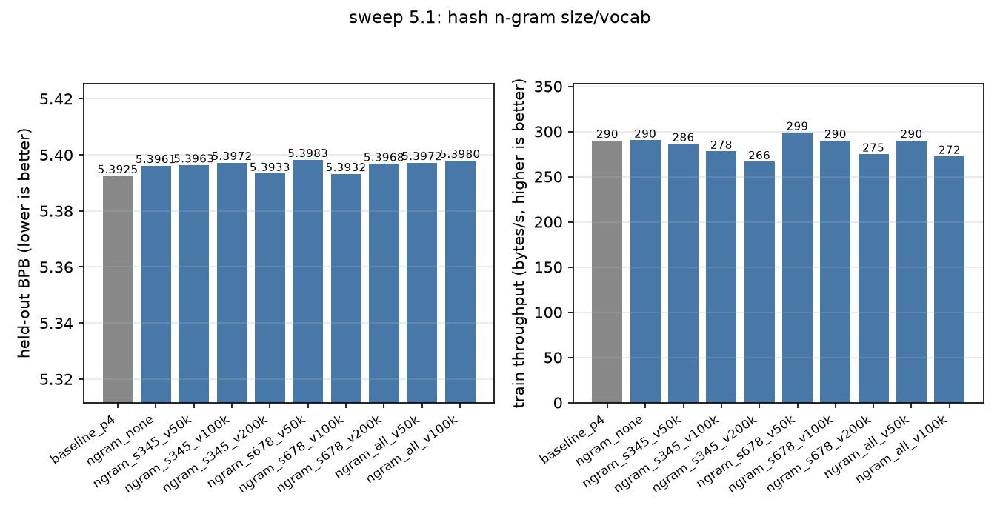
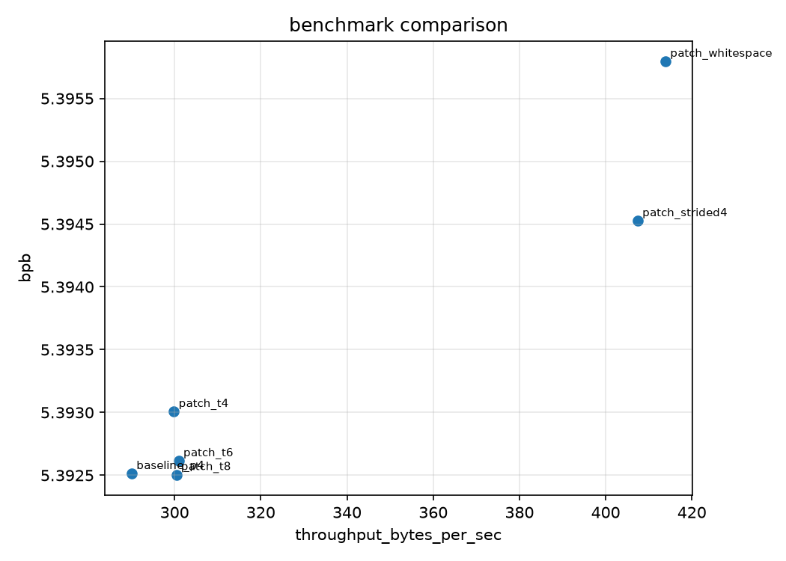

# FBLT

Fast Byte Latent Transformer in pure C and CUDA. A byte-level language model with no tokenizer, built for code completion and small LLMs.

**Status: ~50% done.** Core infrastructure, operators, and components are done. Missing training loop, CUDA kernels, and inference speedups.

Based on two papers from Meta:
- [Byte Latent Transformer](https://arxiv.org/abs/2412.09871) - Direct byte modeling with entropy-based dynamic patching. Matches token-based LLM scaling, no vocabulary needed.
- [Fast Byte Latent Transformer](https://arxiv.org/abs/2605.08044) - Faster inference via diffusion decoding and self-speculation.

## Why no tokenizer?

Tokenizers fix a vocabulary before training, which causes noise sensitivity, poor multilingual/low-resource behavior, and lost character information. The compute/quality tradeoff is baked in at the tokenizer level.

FBLT works directly on bytes. **Entropy-based patching** allocates compute dynamically: predictable bytes get long patches (cheap), hard-to-predict bytes get short patches (more compute).

Result: better scaling, robustness, and no vocabulary constraints.

## How it works

Five-stage pipeline:

1. **Entropy Model** - small byte-level LM that predicts per-byte entropy to guide patching

2. **Patcher** - slices the byte stream into variable-length patches using entropy thresholds (rule-based, no learning)

3. **Local Encoder** -  tiny transformer that compresses byte patches into embeddings, using hash n-gram embeddings to recognize byte patterns without a vocabulary

4. **Patch Transformer** - the main model. Block-causal attention over patches (4-8x shorter than the raw byte sequence).

5. **Local Decoder** - tiny transformer that expands patches back to bytes autoregressively, with optional self-speculation

## Design

Pure C + CUDA.

- **One interface, two backends.** Every op lives in a header, implemented once for CPU and once for CUDA. Model code is backend-agnostic.
- **CPU is the ground truth.** Each op gets a C implementation first. CUDA versions validate against it.
- **Config-driven.** All architecture knobs are JSON config values. (hash sizes, cross-attention placement, layer splits)

## Build

```bash
make test       # build + run tests
make main       # build main executable
make info       # show build config
make clean      # remove obj/, bin/
make help       # show all targets
```

Default is `gcc -O2 -std=c99 -Wall -Wextra`. Change it:

```bash
make CC=clang CFLAGS="-O3 -std=c99 -Wall"
```

CUDA isn't wired up to the Makefile yet.

## Layout

```
include/blt/            Public headers
  ├── core/             Tensor, memory, backend dispatch
  ├── ops/              op signatures
  └── models/           Model component signatures

src/
  ├── core/             Implementation
  ├── backend_cpu/      CPU ops
  ├── models/           Model components

tests/
  |── bench/            Benchmarks
  ├── unit/             op tests
  ├── integration/      Full pipeline tests
  |── py/               Python parity generations
  ├── test_main.c       Entry point
  └── test_helpers.c    Asserts and utilities

run/                    Entry points
configs/                Model configs (JSON)
data/                   Sample data (tests, training, etc.)
tools/                  Scripts and utilities
```


## Ablation sweeps

I ran a first round of architecture ablations on the C code subset of
the-stack-smol (~67 MB train / ~3.7 MB held-out, byte-level) with only the CPU-backend. Each config
trains for a fixed budget (2000 steps, ~17-20 min on my CPU) and reports
held-out BPB. Protocol, tables and caveats live in `docs/ablations.md`,
raw numbers in `bench/results.jsonl`.

Whats interesting: at this scale, doing the opposite of what the paper suggests
worked better -

| config | held-out BPB | throughput |
|---|---|---|
| baseline (paper-ish defaults) | 5.3925 | 290 B/s |
| **winner**: tiny ngram tables, decoder-only cross-attn, fixed-stride-4 patches | **5.3782 (-0.27%)** | **426 B/s (+47%)** |

Bigger ngram hash tables never helped, encoder cross-attention placement
can't matter when the decoder doesn't read patches, and dumb fixed
patching beats entropy-based dynamic patching on throughput for almost no
quality cost. Reproduce with `make sweep` + the configs in `configs/ablations/`.



The n-gram sweep is a good example of "more is not better" — every bigger
table loses to the tiny `{3,4} @ 50k` baseline, and dropping n-gram entirely
costs only +0.07% BPB:

| config | BPB | dBPB | throughput |
|---|---|---|---|
| **baseline `{3,4} @ 50k`** | **5.3925** | — | 290 B/s |
| none | 5.3961 | +0.07% | 290 B/s |
| `{3,4,5}` @ 200k | 5.3933 | +0.01% | 266 B/s |
| `{6,7,8}` @ 100k | 5.3932 | +0.01% | 290 B/s |
| all `{3..8}` @ 100k | 5.3980 | +0.10% | 272 B/s |






## TODO

**Done:**
- Tensor and memory system (arena allocator, shapes, strides)
- Backend dispatch (CPU/CUDA abstraction)
- Core ops on CPU (elementwise, matmul, softmax, attention, etc.)
- Entropy model, patcher
- Attention (causal, cross-attention, custom masks)
- Full test harness (unit, integration, golden files)
- Hash n-gram embeddings
- Local encoder + decoder
- Patch transformer (global model)
- End-to-end forward pass
- FLOP counting and profiling
- Ablation sweeps (BPB tables)

**Todo:**
- Self-speculation (BLT-S) and diffusion decoding (BLT-D)
- CUDA kernels
- Training loop
- Inference/generation
- Benchmarking, multi-GPU

---

## Docs

- `API_REFERENCE.md` - Tensor and op API
- `TEST_API_REFERENCE.md` - Writing tests