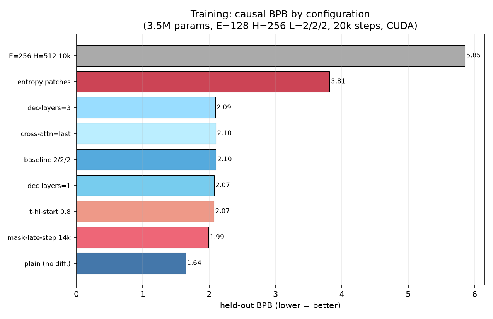
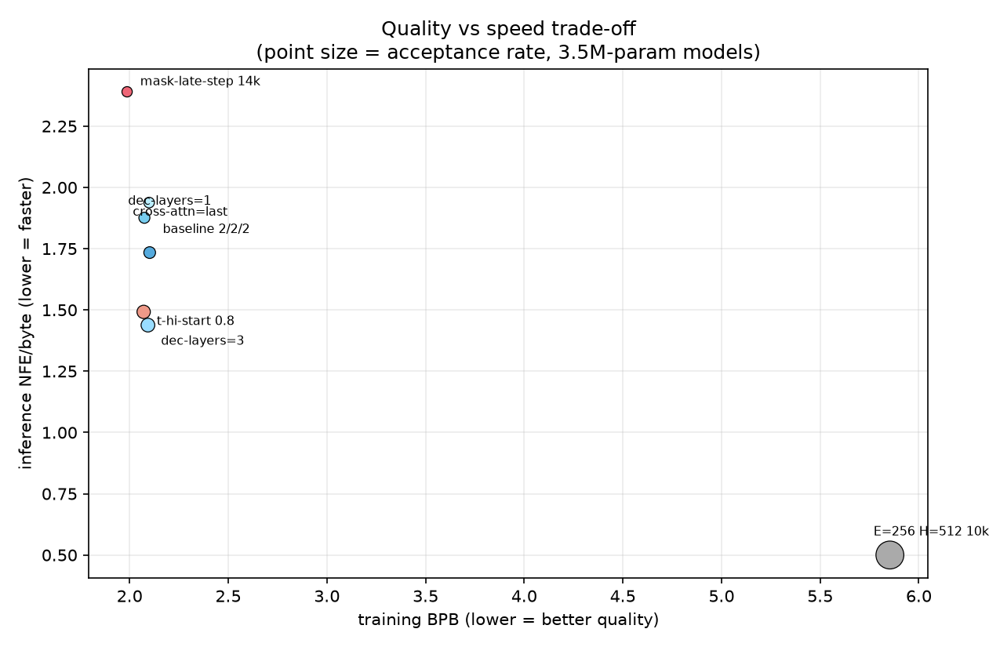
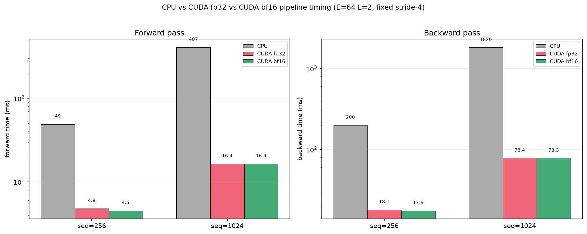

# fBLT

[](https://github.com/iiEliJas/fBLT/actions/workflows/ci.yml)
[](LICENSE)

Fast Byte Latent Transformer in pure C and CUDA. A byte-level language model with no tokenizer, built for code completion and small LLMs.

**Status: CPU + CUDA complete.** Full pipeline on both backends: ops, models, training loop, and all three Fast-BLT inference modes (BLT-S / BLT-D / BLT-DV). Training and inference benchmarked at two scales (300k params and 3.5M params).

Based on two papers from Meta:
- [Byte Latent Transformer](https://arxiv.org/abs/2412.09871) - Byte modeling with entropy-based dynamic patching. Matches token-based LLM scaling, no vocabulary needed.
- [Fast Byte Latent Transformer](https://arxiv.org/abs/2605.08044) - Faster inference with diffusion decoding and self-speculation.

## How it works

Five-stage pipeline:

1. **Entropy Model** - small byte-level LM that predicts per-byte entropy to guide patching

2. **Patcher** - slices the byte stream into variable-length patches using entropy thresholds (rule-based, no learning)

3. **Local Encoder** - tiny transformer that compresses byte patches into embeddings, using hash n-gram embeddings to recognize byte patterns without a vocabulary

4. **Patch Transformer** - the main model. Block-causal attention over patches.

5. **Local Decoder** - tiny transformer that expands patches back to bytes autoregressively, with optional self-speculation

## Build

```bash
make test         # build + run tests
make train-blt-d  # build train_blt_d executable to train
make main         # build main executable
make info         # show build config
make clean        # remove obj/, bin/
make help         # show all targets
```

Default is `gcc -O2 -std=c99 -Wall -Wextra`. Change it:

```bash
make CC=clang CFLAGS="-O3 -std=c99 -Wall"
```

CUDA: `make CUDA=1 <target>` compiles `.cu` files with nvcc, outputs to `obj-cuda/` and `bin-cuda/`. Toggle freely. CPU and CUDA objects never share.

## Layout

```
include/blt/
  core/               Tensor, memory, backend dispatch
  ops/                Op signatures
  models/             Model component signatures

src/
  core/               Implementation
  backend_cpu/        CPU ops
  backend_cuda/       CUDA kernels
  models/             Model components

tests/
  bench/              Benchmarks
  unit/               Op tests
  integration/        Full pipeline tests
  py/                 Python parity generations
  test_main.c         Entry point
  test_helpers.c      Asserts and utilities

run/                  Entry points
configs/              Model configs (JSON)
data/                 Sample data (tests, training, etc.)
tools/                Scripts and utilities
```

## Ablation sweeps

Architecture ablations on ~67 MB of C code (2000 steps, ~17-20 min per run on CPU). The surprising finding: doing the opposite of what the paper suggests worked better.

| config | held-out BPB | throughput |
|---|---|---|
| baseline (paper defaults) | 5.3925 | 290 B/s |
| **winner**: tiny ngram tables, decoder-only cross-attn, fixed-stride-4 patches | **5.3782 (-0.27%)** | **426 B/s (+47%)** |

Bigger ngram hash tables never helped, encoder cross-attention placement can't matter when the decoder doesn't read patches, and dumb fixed patching beats entropy-based dynamic patching on throughput for almost no quality cost.


Full n-gram tables, per-sweep breakdowns, and raw numbers: [BENCHMARKS.md](docs/BENCHMARKS.md) sections 1-5, `bench/results.jsonl`.

Reproduce: `make sweep` + configs in `configs/ablations/`.

## Benchmarks

Three inference modes, benchmarked on 40k-step models (~300k params):

- **BLT-S** - draft k bytes with decoder-only passes, verify with one full forward. Byte-identical output, big savings on encoder/global.
- **BLT-D** - decoder generates a whole block of B future bytes in parallel from masked states. Cheapest per byte, but drafts drift.
- **BLT-DV** - BLT-D drafts, then the model verifies them. Output matches greedy; the draft just makes it cheaper.


BLT-DV sits at ~0.66-0.81 decoder passes per byte with exact greedy quality. Raw BLT-D drafts are 10x cheaper but diverge (agreement 0.08-0.14). The two objectives genuinely interfere: mask-loss weight 1.0 (paper default) costs +2.1 BPB; a warmup + 0.3 cap recovers most of it (1.65 vs 1.26 BPB).

Verified generation equals greedy byte-for-byte only when commit points land on patch boundaries. The implementation forces this. Full results, acceptance rates, latency numbers, and three rejected improvement ideas: [BENCHMARKS.md](docs/BENCHMARKS.md).

```bash
make bench-infer                       # needs runs/*_40k.fblt checkpoints
python3 tools/bench_plots.py           # writes graphs/*.png
```

## At-scale results

Scaled to 3.5M parameters (E=128 H=256 L=2/2/2), trained on CUDA for 20k steps. Nine ablation arms across decoder depth, cross-attention placement, high-t warmup, mask-late schedule, and entropy patching.



Plain BLT wins on language quality (1.64 BPB). Of the diffusion models, the late mask schedule saves ~0.1 BPB by deferring the diffusion loss until the causal head has stabilized. Decoder depth and cross-attention placement barely matter. Entropy patching gets worse at this scale.



The trade-off is real. Late sits top-left (best quality, worst speed), hit and dec3 sit bottom-right (good speed, decent quality). No Pareto-optimal arm. Depends on whether you're bottlenecked on training or inference.



CUDA delivers 150-460x speedup on the full pipeline at E=256. Matmul fp32 hits 6-7 TFLOP/s on the RTX 4060 (~55% MFU). BF16 mixed-precision matmuls engage tensor cores and reach ~19-21 TFLOP/s (~3x the fp32 rate).

```bash
# Training
./bin-cuda/train_blt_d --backend cuda --embed 128 --hidden 256 \
  --steps 20000 --lr 3e-4 --mask-loss-scale 0.3 \
  --t-warmup-hi 0.25 --t-hi-start 0.8 --mask-late-step 14000

# Inference
./bin-cuda/infer_bench --backend cuda --model-runs/s6_plain.fblt \
  --bltd-runs/s6_hit.fblt --prompts 8 --new-bytes 64
```

Full per-arm tables, inference breakdowns, and CUDA micro/meso/macro benchmarks: [BENCHMARKS.md](docs/BENCHMARKS.md) sections 8-9.

## TODO

**Done:**
- Tensor and memory system (arena allocator, shapes, strides)
- Backend dispatch (CPU/CUDA abstraction)
- Core ops on CPU + CUDA (elementwise, matmul, softmax, attention, etc.)
- Entropy model, patcher
- Attention (causal, cross-attention, custom masks)
- Full test harness (unit, integration, golden files)
- Hash n-gram embeddings
- Local encoder + decoder
- Patch transformer (global model)
- End-to-end forward pass
- FLOP counting and profiling
- Ablation sweeps (BPB tables)
- CUDA backend
- At-scale training + inference (9 arms, 3.5M params)

**Todo:**
- Multi-GPU / larger-scale training runs
- Inference improvements

## Docs

- [API_REFERENCE.md](API_REFERENCE.md) - Tensor and op API
- [BENCHMARKS.md](docs/BENCHMARKS.md) - Full benchmark report
- [ABLATIONS.md](ABLATIONS.md) - Ablation sweep results
- [TEST_API_REFERENCE.md](TEST_API_REFERENCE.md) - Writing tests

## Contributing

See [CONTRIBUTING.md](CONTRIBUTING.md) for branch policy, code style, and PR guidelines.

## License

[Apache 2.0](LICENSE)
