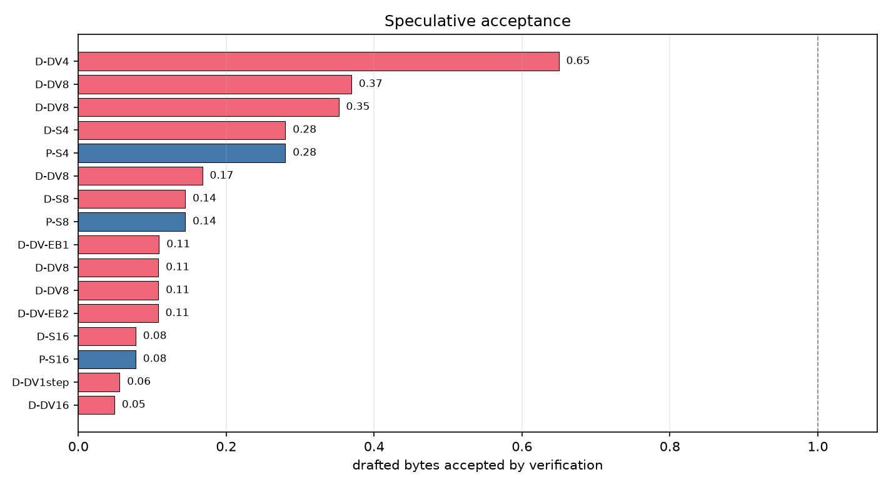
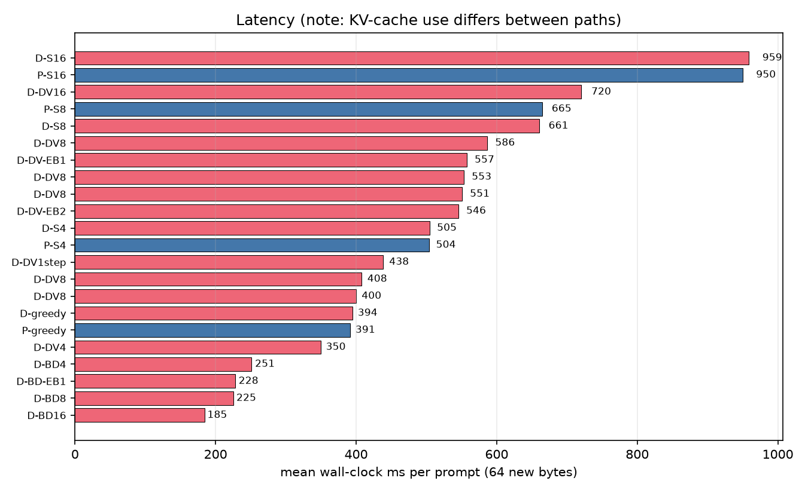

# fBLT

[](https://github.com/iiEliJas/fBLT/actions/workflows/ci.yml)
[](LICENSE)

Fast Byte Latent Transformer in pure C and CUDA. A byte-level language model with no tokenizer, built for code completion and small LLMs.

Based on two papers from Meta FAIR (with Stanford and University of Washington collaborators):
- [Byte Latent Transformer](https://arxiv.org/abs/2412.09871) - Byte modeling with entropy-based dynamic patching. Matches token-based LLM scaling, no vocabulary needed.
- [Fast Byte Latent Transformer](https://arxiv.org/abs/2605.08044) - Faster inference with diffusion decoding and self-speculation.

**Status**: research prototype

## Table of contents

- [How it works](#how-it-works)
- [Prerequisites](#prerequisites)
- [Quickstart](#quickstart)
- [Build](#build)
- [Layout](#layout)
- [Training configuration](#training-configuration)
- [Inference](#inference)
- [Benchmarks](#benchmarks)
- [Community experiments](#community-experiments)
- [Issues](#issues)
- [TODO](#todo)
- [Docs](#docs)
- [Contributing](#contributing)
- [References](#references)
- [License](#license)

## How it works

Five-stage pipeline:

1. **Entropy Model**: small byte-level LM that predicts per-byte entropy used for patching

2. **Patcher**: chops the byte stream into patches using entropy thresholds (rule-based so no learning)

3. **Local Encoder**: tiny transformer that compresses byte patches into embeddings, using hash n-gram embeddings to recognize byte patterns without a vocabulary

4. **Patch Transformer**: the main model. Block-causal attention over patches.

5. **Local Decoder**: tiny transformer that expands patches back to bytes, with optional self-speculation

## Prerequisites

- C compiler (`gcc` or `clang`), C99-compatible
- CMake >= 3.18
- Python >= 3.9
- (Optional, for GPU training/inference) CUDA toolkit with `nvcc`

## Quickstart

```bash
pip install -e .                    # install fblt package + entry points

# Build C binaries
cmake -S . -B build                  # CPU build
cmake --build build -j$(nproc)       # build all targets

# Or for CUDA:
cmake -S . -B build-cuda -DUSE_CUDA=ON
cmake --build build-cuda -j$(nproc)

python fblt/scripts/build_sample_corpus.py  # generate sample training data from repo source

# Train a tiny model (debug config, 10 steps)
fblt-train --config configs/train/debug.yaml --backend cpu

# Generate text from the trained checkpoint (auto-shapes from resolved_config.yaml)
fblt-infer --checkpoint "runs/debug-*/checkpoint.fblt" --backend cpu --prompt "int main"
```

The sample corpus is generated from the repo's own `.c`/`.h` source files (~1.1 MB) under the Apache 2.0 license. The debug config trains a small model in seconds. For production training, use `configs/train/production.yaml` with your own larger corpus (e.g., the stack-smol-C-derived dataset used for the benchmark results).

### Using your own dataset

The training binary expects a flat `.bin` file of raw bytes with no header, no framing, no length prefix. If you're using multiple source files, separate them with a newline (`\n`).

To use your own data, place the `.bin` file in the repo and point the config at it:

```bash
# Option 1: edit the config
# configs/train/production.yaml:
#   corpus: /path/to/your/train.bin

# Option 2: override on the command line
fblt-train --config configs/train/production.yaml --backend cpu \
  --override corpus=/path/to/your/train.bin
```

For heldout evaluation, set `--eval-corpus` to a separate `.bin` file not overlapping with your training data. The inference benchmark (`infer_bench`) defaults to `data/heldout.bin` for this purpose.

### Resuming training

Checkpointing stores weights and, optionally, the optimizer state. Saving both lets a run be
extended in place rather than restarted:

```yaml
# configs/train/production.yaml
save_weights: runs/prod/checkpoint.fblt
save_optim: runs/prod/checkpoint.fbop     # AdamW moments + step counter
```

```bash
# first run
fblt-train --config configs/train/production.yaml --backend cuda --override steps=300000

# extend it by another 300k steps
fblt-train --config configs/train/production.yaml --backend cuda --override steps=300000 \
  --override load_weights=runs/prod/checkpoint.fblt \
  --override load_optim=runs/prod/checkpoint.fbop
```

`steps` is how many steps to run this time. The step counter continues from the optimizer
snapshot, so logs and step-indexed schedules (`lr_decay_steps`, `mask_late_step`) pick up where
they stopped, and a resumed run is bit-identical to one long uninterrupted run. Use
`--override start_step=N` to override the stored counter.

Omitting `load_optim` still resumes the weights, but the optimizer restarts cold from zeroed
moments, so the first steps behave like from-scratch AdamW.

### Matching training at inference

Block-diffusion inference only works if it segments bytes the same way training did. Two settings
have to line up:

- the **entropy LM** used for patching, which is trained separately and passed with `entropy_lm`
- the **block size** `B`, which must equal the `block_size` the checkpoint was trained with

`fblt-infer` reads both from the `resolved_config.yaml` next to the checkpoint, so the quickstart
command above works unchanged. The `build/infer` binary has no way to know them and requires both
to be passed explicitly:

```bash
build-cuda/infer --checkpoint runs/prod/checkpoint.fblt \
  --embed 256 --hidden 512 --enc-layers 2 --glob-layers 6 --dec-layers 2 \
  --backend cuda --method blockdv --block-size 4 \
  --entropy-lm runs/entropylm/entropy_lm.fblt \
  --prompt "Once upon a time" --new-bytes 200
```

Training with `--entropy-patches`? Keep `--entropy-lm` set in your training config so the
snapshot can be carried over. Models trained without it use fixed-stride-4 patching, which
inference selects automatically.

## Build

```bash
# CPU build
cmake -S . -B build -DUSE_CUDA=OFF
cmake --build build -j$(nproc)                 # build all targets
cmake --build build --target test              # build + run C test suite

# CUDA build
cmake -S . -B build-cuda -DUSE_CUDA=ON
cmake --build build-cuda -j$(nproc)            # build all targets
cmake --build build-cuda --target test         # build + run C test suite

# Other useful targets
cmake --build build --target main              # build main executable
cmake --build build --target train_blt_d       # build trainer
cmake --build build --target infer             # build inference binary
cmake --build build --target sandbox_run       # build + run sandbox
cmake --build build --target bench-infer       # build + run inference benchmark
```

Default is `gcc -O2 -std=c99 -Wall -Wextra`. Change it:

```bash
cmake -S . -B build -DCMAKE_C_COMPILER=clang -DCMAKE_C_FLAGS="-O3 -std=c99 -Wall"
```

CUDA: `cmake -S . -B build-cuda -DUSE_CUDA=ON` enables CUDA support and compiles `.cu` files with `nvcc`. The default architecture is `89`; configure another GPU with `-DCMAKE_CUDA_ARCHITECTURES=86` or the value required by your device. If `nvcc` is installed outside `/usr/local/cuda`, pass `-DCUDAToolkit_ROOT=/path/to/cuda` or `-DCMAKE_CUDA_COMPILER=/path/to/nvcc`.

On WSL2, if an apt NVIDIA library shadows the WSL driver, put the WSL driver directory first on `LD_LIBRARY_PATH` and set `CUDA_VISIBLE_DEVICES=0` if the variable is empty.

### Python setup

```bash
python3 -m venv .venv
source .venv/bin/activate
pip install -e .                      # install fblt package + entry points
pip install ruff pytest               # dev dependencies
```

Requires Python >= 3.9.

Run Python tests and lint checks:

```bash
pytest tests/                         # run Python test suite
ruff check .                          # lint
ruff format --check .                 # format check
```

For the C test suite parity tests, generate golden data first:

```bash
pip install torch numpy
python tests/py/parity_generate.py  # or: cmake --build build --target parity-data
cmake --build build --target test   # build + run C tests
```

## Layout

```
csrc/
  core/               Core: tensor, memory, backend, allocator, JSON, tools
  ops/                Op signatures + CPU/CUDA implementations
  models/             Model components
  infer/              Inference: KV cache, speculation, block generation

fblt/                 Python package
  __init__.py
  train.py            Training entry point (fblt-train)
  infer.py            Inference entry point (fblt-infer)
  _binary.py          Binary path resolution
  _config.py          TrainConfig / InferConfig dataclasses, YAML loader
  _runner.py          Subprocess runner with live streaming
  scripts/            Utilities (bench_plots, bench_report, gen_configs, prep_corpus, build_sample_corpus)

configs/
  train/              Training YAML configs (production, debug)
  infer/              Inference YAML configs (greedy, selfspec, blockdiff, blockdv)
  ablations/          Ablation sweep configs (JSON)

tests/                Test suite (C + Python)
bench/                Benchmarks
run/                  C entry points (train_blt_d.c, infer.c, etc.)
data/                 Training data (sample corpus, golden test tensors)

build/                CMake build output (CPU)
build-cuda/           CMake build output (CUDA, when -DUSE_CUDA=ON)
```

## Training configuration

An example for the production config for 2.97M-parameter BLT-D training (embed=192, hidden=384, 2/2/2 layers):

```bash
fblt-train --config configs/train/production.yaml --backend cuda
```

The wrapper creates a run directory under `runs/`, writes a `resolved_config.yaml` with the full config, and calls `train_blt_d`. All `--override key=value` flags are passed through, and `--backend` is always required on the command line (never in YAML).

The underlying C binary can still be called directly:

```bash
./build-cuda/train_blt_d --backend cuda \
  --embed 192 --hidden 384 --layers 2 \
  --steps 40000 --lr 0.05 --lr-decay 1 \
  --mask-warmup 33200 --mask-scale 0.3 \
  --t-min 0.1 --t-warmup-hi 0.25 --t-hi-start 0.8 \
  --cross-attn all --optimizer sgd \
  --diffusion 1 --block-size 4 --window 48 \
  --save-weights runs/my_checkpoint.fblt
```

## Inference

### Generating text from a checkpoint

Use `fblt-infer` to generate text from a trained model:

```bash
fblt-infer --checkpoint runs/debug_checkpoint.fblt --backend cpu \
  --config configs/infer/greedy.yaml --prompt "int main"
```

If the checkpoint was produced by `fblt-train`, the wrapper auto-detects model dimensions from `resolved_config.yaml`. So no need to pass `--embed`, `--hidden`, etc. manually. For checkpoints not produced by the wrapper, pass shape flags via `--override`:

```bash
fblt-infer --checkpoint my_model.fblt --backend cpu \
  --override embed=192 --override hidden=384 \
  --override enc-layers=2 --override glob-layers=2 --override dec-layers=2 \
  --prompt "def "
```

Inference methods: `greedy` (default), `selfspec`, `blockdiff`, `blockdv`. See `configs/infer/` for example YAML configs for each method.

## Benchmarks
Full results: [BENCHMARKS.md](docs/BENCHMARKS.md).

CUDA delivers **76x training speedup** and **34x generation speedup** over CPU at production config (E=192, H=384, 2.97M params). The training cell is synthetic; the generation cell loads a checkpoint whose default path no longer exists in this repo, so those two numbers are historical rather than reproducible as-is. CPU baseline is single-threaded naive loops. Matmul fp32 hits **6.4 TFLOP/s** on the desktop RTX 4060 (**42.4% MFU** against the 15.11 TFLOP/s spec peak). BF16 mixed-precision matmuls reach **~20 TFLOP/s** (~3x the fp32 rate).

The CUDA figures above come from `bench/cuda_bench`, which uses synthetic weights and needs no checkpoint.

Inference comparisons use a separate tool, `infer_bench`:

```bash
cmake --build build-cuda --target infer_bench
./build-cuda/infer_bench --backend cuda \
  --plain runs/tinystories_600k/tinystories_600k.fblt \
  --bltd runs/tinystories_600k/tinystories_600k.fblt \
  --entropy-lm runs/entropylm/entropy_lm.fblt \
  --heldout data/tinystories/heldout.bin \
  --embed 256 --hidden 512 --enc-layers 2 --glob-layers 6 --dec-layers 2 \
  --prompts 8 --new-bytes 64 \
  --results bench/results_tinystories_10m.jsonl
python3 fblt/scripts/bench_plots.py --results bench/results_tinystories_10m.jsonl --out graphs
```

`--entropy-lm` is mandatory: without the trained entropy LM every byte becomes its own patch and the
numbers describe nothing. `--block-size` must match training. Both tools abort rather than measure a
mismatch.

Three inference modes, benchmarked on the 7.8M-param TinyStories BLT-D checkpoint (600k steps,
trained at `B=4` with entropy patching):

- **BLT-S**: draft k bytes with decoder-only passes, verify with one full forward. Byte-identical output, fewer encoder passes.
- **BLT-D**: decoder generates a whole block of future bytes in parallel from masked states. Cheapest per byte, but drafts drift (18% agreement with greedy at B=4).
- **BLT-DV**: BLT-D drafts, then the model verifies them. Output matches greedy so the draft just makes it cheaper.

**Headline finding:** at the trained block size, BLT-DV is a net win. At `B=4` it accepts 65.0% of
drafted bytes, produces output byte-identical to greedy, and costs 0.85x the memory bandwidth and
0.89x the wall-clock of greedy (350 ms vs 394 ms per 64-byte prompt). At `B=8` and above it loses
badly (10.8% and 4.9%), because block cells past the trained size form a block L_mask never
supervised. Entropy patching more than doubles acceptance over fixed-stride (65.0% vs 28.7%).


*Drafted-byte acceptance by method. BLT-DV at the trained `B=4` leads at 65%; every `B>=8` variant collapses.*


*Mean wall-clock ms per prompt (64 new bytes). KV-cache usage differs between inference paths, so these are rough wall-clock numbers, not a clean comparison.*

### Ablation sweeps

Architecture and schedule ablations at 2.97M parameters (embed=192, hidden=384, 2/2/2 layers) on ~67 MB of C source code. Each axis tested with 3-6 seeds at 40k steps.

| Setting | Value | Finding |
|---|---|---|
| Step budget | 40k | Safe convergence floor; masked acc > 0.99 across seeds (cliff sits somewhere at 25k-35k) |
| Mask-warmup | 83% of steps | 95% is a minor improvement, not required |
| Decoder depth | 2 layers | Deeper decoder (3-4 layers) doesn't help, 2/2/2 is optimal |
| Encoder depth | 2 layers | Deeper encoder (3/2/2) is harmful, 2 layers is best |
| Cross-attn | all or last | base (all) and xlast (last) tied at 83% warmup, xlast ~15% faster |
| High-t warmup | on | Improves BPB by 0.33 (2.7x noise floor), no instability |
| Mask-late | off | No benefit found |

Full tables, raw numbers, and production config: [ABLATIONS.md](docs/ABLATIONS.md).

## Community experiments

fBLT is small and I have more ideas than time to test them. If you change
something and see what happens, tell me about it. It does not matter if it
worked or not.

Try a different hyperparameter, run it on another corpus, push it to a
bigger scale, or look into the CUDA non-determinism from Known issues. You
do not need a plan. Just curiosity and a GPU, or a patient CPU.

Open an issue with what you changed, your hardware, and the command you
used. Attach the `resolved_config.yaml` from your run directory so others
can repeat it. If you have numbers, add them even if they are rough: BPB,
acceptance rate, wall-clock, anything.

Negative results count too. They save the next
person from trying it too ;D

## Issues

- Seed-dependent non-determinism from CUDA atomics.

- [CLOSED] Acceptance-rate root cause at this scale. The previously reported 1.6-5.2% was measured with a
random-init entropy LM in `infer_bench`, which put every byte in its own patch. With the trained LM
the same checkpoint accepts 65.0% at B=4. `infer_bench` now refuses to run without `--entropy-lm`
(see PR #33). See docs/BENCHMARKS.md.

- [CLOSED] [last_row_gap.md](docs/experiments/last_row_gap.md) Last-row accuracy inside each training window sits far below interior-row accuracy (~40% vs ~98%). 
Two Hypotheses are being considered. Either the last row gets far less supervision per window than interior rows.
Or patches that get cut off at the window edge are harder for the model to represent. 

- [forced_boundary_patches.md](docs/experiments/forced_boundary_patches.md) Open issue on comparing forced-boundary patches to natural closed patches.

- [patch_cap_limit.md](docs/experiments/patch_cap_limit.md) The 128-patch cap is another open issue. I added it because BLT-D did not support more patches at the time. Raising it and measuring the effect is an open experiment i have not yet done.

## TODO
- Inference improvements
- Multi-GPU / larger-scale training runs
- MacOS support
- Test acceptance rates on models trained at larger B, since B=8 and above currently measure a
  train/inference mismatch rather than a capability limit

## Docs

- [BENCHMARKS.md](docs/BENCHMARKS.md) - Full benchmark report
- [ABLATIONS.md](docs/ABLATIONS.md) - Ablation sweep results
- [CLI_REFERENCE.md](docs/CLI_REFERENCE.md) - CLI commands for training and inference
- [last_row_gap.md](docs/experiments/last_row_gap.md) - Closed investigation into the last-row accuracy gap

## Contributing

See [CONTRIBUTING.md](CONTRIBUTING.md) for branch policy, code style, and PR guidelines.

## References

If you build on this work, please consider citing the foundational Meta papers:

```bibtex
@misc{pagnoni2024bytelatenttransformerpatches,
      title={Byte Latent Transformer: Patches Scale Better Than Tokens},
      author={Artidoro Pagnoni and Ramakanth Pasunuru and Pedro Rodriguez and John Nguyen and
              Benjamin Muller and Margaret Li and Chunting Zhou and Lili Yu and Jason Weston and
              Luke Zettlemoyer and Gargi Ghosh and Mike Lewis and Ari Holtzman and Srinivasan Iyer},
      year={2024},
      eprint={2412.09871},
      archivePrefix={arXiv},
      primaryClass={cs.CL},
      doi={10.48550/arXiv.2412.09871}
}

@misc{kallini2026fastbytelatenttransformer,
      title={Fast Byte Latent Transformer},
      author={Julie Kallini and Artidoro Pagnoni and Tomasz Limisiewicz and Gargi Ghosh and
              Luke Zettlemoyer and Christopher Potts and Xiaochuang Han and Srinivasan Iyer},
      year={2026},
      eprint={2605.08044},
      archivePrefix={arXiv},
      primaryClass={cs.CL}
}
```

## License

[Apache 2.0](LICENSE)
