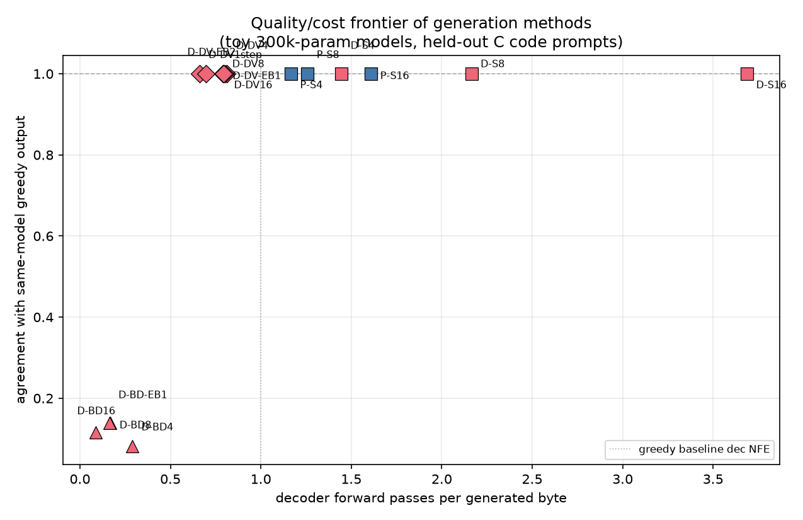
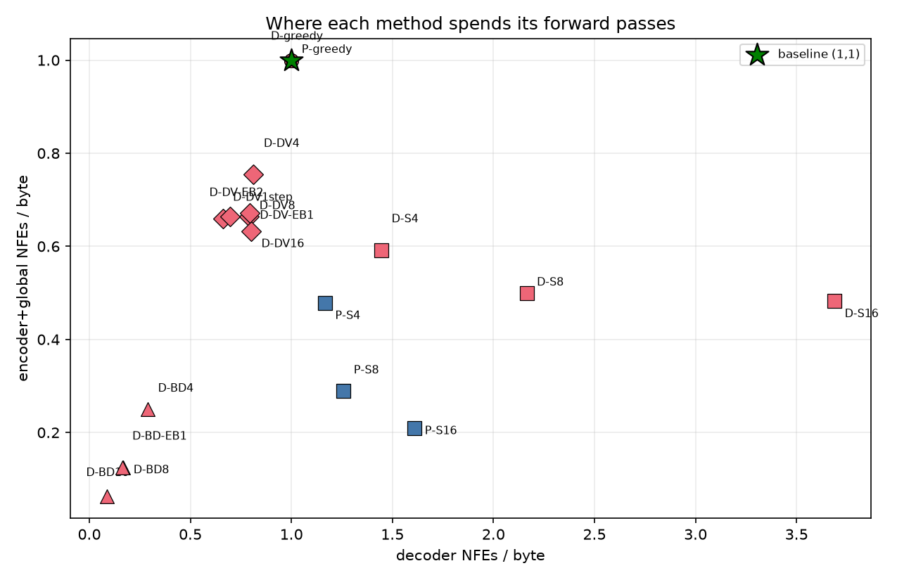

# FBLT Benchmarks and Results

All experiments in this report were run on the CPU-only C implementation
(gcc -O2, single core) at deliberately small scale: ~300k-parameter
models trained on ~67 MB of C source code from The Stack (smol), with a
~3.7 MB held-out split. The goal is not absolute quality - a model this
size cannot compete with production LMs - but **relative comparisons
between training objectives and inference methods under identical
conditions**. Every number is reproducible; see
[Reproducing](#reproducing) at the end.

---

## 1. Setup

| | |
|---|---|
| Corpus | 67.5 MB C code (`data/train.bin`), 3.7 MB held-out (`data/heldout.bin`) |
| Model | BLT: local encoder + global patch transformer + local decoder, 2 layers each, embed 64 / hidden 128, ~300k params |
| Training | SGD, lr 0.05 with x0.3 decay at 60%/85% of the schedule, gradient-norm clip 5.0, batch = one 48-byte window |
| Quality metric | **BPB** - bits per byte of held-out next-byte prediction (lower is better; 8.0 = random guessing) |
| Diffusion quality | **masked-cell top-1** - accuracy of predicting bytes in a masked future block |
| Speed metrics | **NFE** - forward passes of a submodule (decoder vs encoder+global) per generated byte; wall-clock |
| Speed quality | **agreement** - fraction of generated bytes identical to what plain greedy decoding produces with the same model |

Two trained checkpoints are used throughout:

- **plain** - standard next-byte objective only (`runs/plain_40k.fblt`)
- **bltd** - combined next-byte + masked-block diffusion objective
  (Fast-BLT Eq. 7), mask-loss weight capped at 0.3 after a 10k-step
  warmup (`runs/bltd_l03_40k.fblt`)

---

## 2. Training: what the diffusion objective costs and buys

### 2.1 The objective trade-off

BLT-D trains one decoder with two losses: normal next-byte prediction
(`L_clean`) and masked-future-block prediction weighted by `1/t`
(`L_mask`). The relative weight is the single most important training
setting at this scale:

| Model | Steps | Mask-loss weight | Held-out BPB |
|---|---|---|---:|
| plain BLT | 10k | - | 2.72 |
| plain BLT | 20k | - | 2.07 |
| **plain BLT** | **40k** | - | **1.26** |
| BLT-D | 10k | 1.0 (paper default) | 3.62 |
| BLT-D | 20k | 1.0 | 3.34 |
| BLT-D | 20k | warmup 0->1 over 10k | 3.03 |
| BLT-D | 20k | warmup, capped at 0.3 | 2.89 |
| **BLT-D** | **40k** | **warmup, capped at 0.3** | **1.65** |

Findings:

- **The interference is real and monotone.** Every increase in
  mask-loss weight costs next-byte quality. The Fast-BLT paper
  acknowledges this trade-off (its own BLT-D models score slightly
  worse on next-byte benchmarks than BLT) and explicitly sanctions
  reweighting toward next-byte prediction - which is exactly what the
  0.3 cap does.
- **A silent-mask control proves the machinery is correct.** Running
  the full BLT-D pipeline with the mask loss disabled lands at 2.13 BPB
  vs the plain arm's 2.07 at matched settings - parity within noise.
  Masks, corruption sampling, forward, backward, and the learned MASK
  embedding all behave exactly like the plain objective when the mask
  term is off.
- **Stability requires a timestep floor.** The `1/t` loss weight
  explodes as `t -> 0` (weights up to ~10^6 for rare draws). Clamping
  `t >= 0.05` and flooring softmax probabilities removed all loss
  spikes / inf events.

### 2.2 Generalization

Held-out BPB measured at three offsets into the held-out file (0 B,
500 KB, 2 MB) to rule out memorization of the eval head:

| Model (40k steps) | 0 B | 500 KB | 2 MB |
|---|---:|---:|---:|
| plain | 1.26 | 1.34 | 1.43 |
| BLT-D (cap 0.3) | 1.65 | 1.76 | 1.99 |

Numbers degrade only gently with depth - both models genuinely
generalize rather than memorize. (An earlier contamination suspicion
turned out to be a checkpoint-loading bug - the trainer's random
initialization ran *after* weight loading and overwrote it. Fixed; the
loader now skips initialization entirely.)

### 2.3 What diffusion training buys

The BLT-D model predicts masked future blocks at **~100% top-1
accuracy** on held-out text (17,675 / 17,678 cells in one
representative eval). This is the capability the fast diffusion decoder
relies on: the patch latent already summarizes the byte span a block
predicts, so a trained block predictor is nearly deterministic given
context.

**Bottom line:** plain BLT remains the better pure language model
(1.26 vs 1.65 BPB), but BLT-D gains a saturated block-prediction
capability for roughly 0.4 BPB - a good trade for inference speed, and
the same direction as the paper's own reported trade-off.

---

## 3. Inference: generation methods compared

### 3.1 The methods

| Method | How it generates | Expected cost |
|---|---|---|
| **greedy** (baseline) | one full encoder+global+decoder forward per byte | 1.0 decoder NFE/byte, 1.0 enc NFE/byte |
| **BLT-S** (self-speculation) | draft k bytes with decoder-only passes, verify all k with one full forward; accept the longest matching prefix | more decoder NFEs, far fewer encoder NFEs |
| **BLT-D** (block diffusion) | start a block of B masked positions, iteratively unmask the most confident ones; accept drafts as-is | cheapest per byte, output may diverge from greedy |
| **BLT-DV** (diffusion + verification) | BLT-D drafts, then a full causal forward verifies them like BLT-S | ~0.7-0.8 decoder NFEs/byte, output ~= greedy |

Unmasking strategies inside BLT-D/DV: **confidence-based** (unmask all
cells with p_max >= alpha, fallback: single best cell) and
**entropy-bounded / EB** (unmask the largest set whose entropies sum
under gamma). Optional top-p sampling replaces greedy argmax when
diversity is wanted.

Protocol: 8 held-out prompts (64 bytes each, taken from deep offsets in
the held-out file) x 64 generated bytes, aggregated over 512 bytes per
config.

### 3.2 Results

| Config | dec NFE/byte | enc NFE/byte | acceptance | agreement |
|---|---:|---:|---:|---:|
| plain greedy | 1.00 | 1.00 | - | 1.00 |
| plain BLT-S k=4 | 1.17 | 0.48 | 0.82 | 1.00 |
| plain BLT-S k=8 | 1.26 | 0.29 | 0.77 | 1.00 |
| plain BLT-S k=16 | 1.61 | 0.21 | 0.59 | 1.00 |
| bltd greedy | 1.00 | 1.00 | - | 1.00 |
| bltd BLT-S k=4 | 1.45 | 0.59 | 0.61 | 1.00 |
| bltd BLT-S k=8 | 2.16 | 0.50 | 0.39 | 1.00 |
| bltd BLT-S k=16 | 3.69 | 0.48 | 0.22 | 1.00 |
| bltd BLT-D B=4 | 0.29 | 0.25 | n/a | 0.08 |
| bltd BLT-D B=8 | 0.17 | 0.13 | n/a | 0.14 |
| bltd BLT-D B=16 | 0.09 | 0.06 | n/a | 0.12 |
| bltd BLT-DV B=4 | 0.81 | 0.75 | 0.43 | 1.00 |
| bltd BLT-DV B=8 | 0.79 | 0.66 | 0.26 | 1.00 |
| bltd BLT-DV B=16 | 0.80 | 0.63 | 0.15 | 1.00 |
| bltd BLT-DV one-step | 0.66 | 0.66 | 0.26 | 1.00 |
| bltd BLT-DV-EB gamma=1 | 0.79 | 0.67 | 0.26 | 1.00 |
| bltd BLT-DV-EB gamma=2 | 0.70 | 0.66 | 0.26 | 1.00 |

Wall-clock (informational - the BLT-S path uses a KV cache the greedy
baseline does not, so treat as directional): plain BLT-S k=16 is
**5.1x faster** than greedy; raw BLT-D B=16 is 13x faster but
quality-divergent.

### 3.3 Reading the numbers



Everything on the agreement = 1.0 line is exactly greedy quality.
BLT-DV reaches ~0.66-0.81 decoder passes per byte there. Raw BLT-D
drafts are ~10x cheaper but diverge from greedy (agreement 0.08-0.14) -
useful for diverse/creative sampling, not for exact continuation.



BLT-S trades *more* decoder passes for *far fewer* encoder+global
passes (1.0 -> 0.21 at k=16). It wins when the encoder+global stack
dominates cost. BLT-D/DV attack the decoder side instead. The two are
complementary axes.


BLT-S accepts 82% of drafted bytes on the well-trained plain model -
self-speculation works. On the BLT-D model it drops to 61%/39%/22%: the
diffusion objective costs the causal head precision (Section 2.1), and
that tax shows up again at inference time. BLT-DV acceptance (15-43%)
is limited by the fully-masked regime being under-trained when the mask
loss is capped at 0.3.


### 3.4 Takeaways

1. **BLT-S is the toy-scale champion** for exact generation: 5x
   wall-clock, byte-identical output, on a well-trained causal model.
2. **BLT-DV is exact and still saves ~20-34% decoder passes** - and
   one-step diffusion + verification (unmask the whole block in a
   single pass, then verify) is the best DV variant, matching the
   paper's "one-step + verify is fastest" finding.
3. **Raw BLT-D is a sampling mode, not a replacement for greedy** at
   this scale.

---

## 4. When does verified generation exactly equal greedy?

A guarantee worth understanding: **BLT-DV output equals greedy output
byte-for-byte only when commit points land on patch boundaries.**

Verification computes its next-byte predictions from one forward pass
over the committed prefix plus the draft. If the patcher's final prefix
patch extends past the commit point, it absorbs draft bytes, its latent
changes, and predictions near the boundary can shift relative to what
greedy (which re-segments after every single byte) would produce.

- With a degenerate patcher whose patches are 1-2 bytes long, every
  position is a patch boundary and equality is exact - this is the
  configuration used for the Section 3 tables and enforced as a hard
  gate in the unit tests.
- With any content-driven patcher, equality becomes approximate
  (measured agreement 0.59-1.00 across configs). The benchmark gates DV
  at agreement >= 0.90 instead of exactness.

`blt_verify_draft` forces a patch boundary at the commit point before
encoding the candidate - strictly more correct, and it measurably
improves agreement under real patchers (e.g., BLT-S k=16 agreement
0.746 -> 0.807).

---

## 5. Improvement experiments (what worked, what didn't)

After the benchmarks above, three intuitive improvement ideas were put
to the test. Two failed but the failures are as good for the project as the wins.

### 5.1 Fixed-stride patching at inference - rejected

The checkpoints were trained with fixed-stride-4 patches, so why not
generate with the same? Because commit points then land mid-patch
constantly, which (per Section 4) breaks verification equivalence
outright, and acceptance does not improve (0.41/0.23/0.14 vs
0.43/0.26/0.15). Rejected.

### 5.2 Raising the mask-loss weight late in training - rejected

Idea: keep the mask weight at 0.3 while the causal head stabilizes,
then ramp toward 1.0 to strengthen the fully-masked regime that
drafting relies on. Result: the mask gradient (per-cell weight up to
1/t = 20) overwhelms the decayed final stretch - training loss rose
4 -> 17 and causal BPB went 1.65 -> 4.10. Rejected at this scale; worth
retrying with a gentler ramp and more data.

### 5.3 Training the entropy model and matching patchers - rejected (at this scale)

The inference patcher needs an entropy model; ours was randomly
initialized (its near-uniform entropies produce 1-2 byte patches -
which, per Section 4, is why verification equality looked exact).
Training a proper 1-layer entropy model (CE ~ 2.7 nats) and retraining
BLT-D on its boundaries:

- training converged much better (final loss 2.0 vs 4+; causal BPB 3.85
  vs 9.64 for the old model evaluated under the same patcher) -
  content-aligned, stable boundaries are genuinely easier to learn from
- **but generation got worse**: BLT-S acceptance 0.42/0.22/0.12 (vs
  0.54/0.33/0.18), raw-draft agreement 0.03-0.04 (vs 0.09-0.14)

At 300k parameters the context fragmentation from variable-length
patching costs more than boundary consistency buys. The trained entropy
model and its tooling remain in place for larger-scale runs, where the
paper's patcher-consistency argument should eventually win.

### 5.4 Kept: the verification boundary fix

Forcing a patch boundary at the commit point (Section 4) is the one
change from this round that shipped - it is strictly more correct and
improves agreement under any real patcher.

---

## 6. Conclusions

1. **Training.** Plain BLT is the better language model (1.26 BPB);
   BLT-D trades ~0.4 BPB for saturated masked-block prediction. The
   mask-loss weight is the key setting: warmup plus a 0.3 cap recovers
   most of the causal quality while keeping the diffusion capability.
2. **Inference.** BLT-S gives exact generation 5x faster wall-clock.
   BLT-DV gives exact-quality generation at 0.66-0.81 decoder passes
   per byte; one-step diffusion + verification is its best
   configuration. Raw BLT-D is a cheap sampling mode.
3. **Correctness.** Verified-generation equality is boundary-conditioned;
   the implementation forces commit-point patch boundaries and documents
   the exactness condition.
4. **Scale warnings.** All conclusions are drawn at 300k parameters on
   67 MB of data; absolute numbers will move with scale, but the
   *relative* method comparisons (which share fixed models and data)
   are the robust takeaway. The paper's own results at 1-3B parameters
   show the same qualitative ordering.

---

## 7. Reproducing

Training (checkpoints used here):

```bash
make train-blt-d
./bin/train_blt_d --corpus data/train.bin --eval-corpus data/heldout.bin \
    --eval-windows 300 --steps 40000 --diffusion 0 --lr-decay 1 --seed 7 \
    --save-weights runs/plain_40k.fblt
./bin/train_blt_d --corpus data/train.bin --eval-corpus data/heldout.bin \
    --eval-windows 300 --steps 40000 --diffusion 1 --t-min 0.05 \
    --mask-warmup 10000 --mask-scale 0.3 --lr-decay 1 --seed 7 \
    --save-weights runs/bltd_l03_40k.fblt
```

Inference benchmark and charts:

```bash
make bench-infer                      # appends to bench/results.jsonl
python3 tools/bench_plots.py   # writes runs/bench_graphs/
```

Single-prompt generation driver:

```bash
make e2e-dv
./bin/e2e_blt_dv --block-size 4 --new-bytes 64 --prompt "int main(void) {"
```

Raw result history lives in `bench/results.jsonl` (experiment group `6_infer`);
per-experiment notes in `runs/`.
