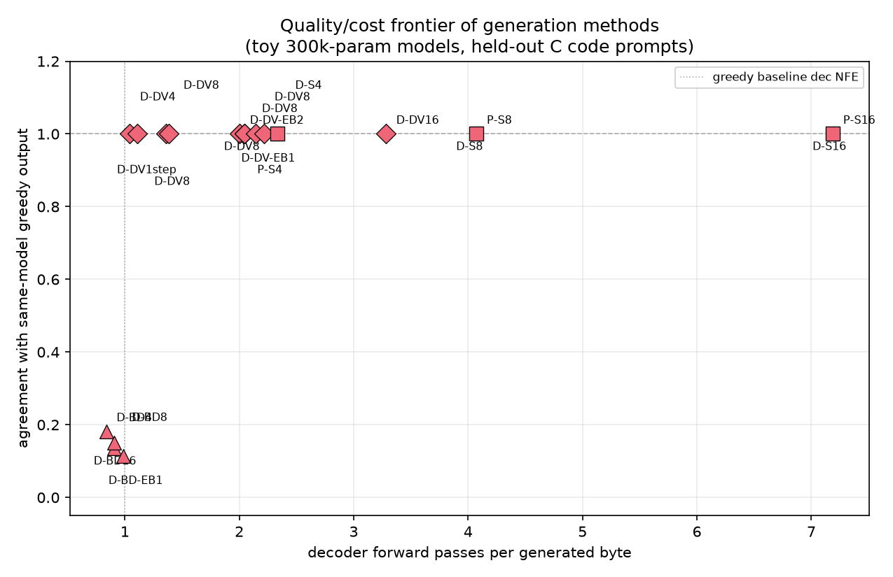
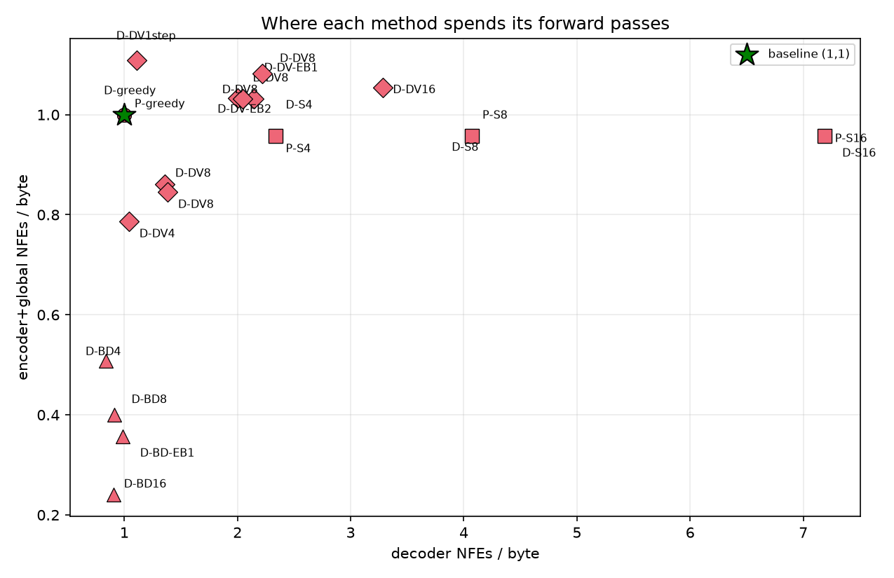
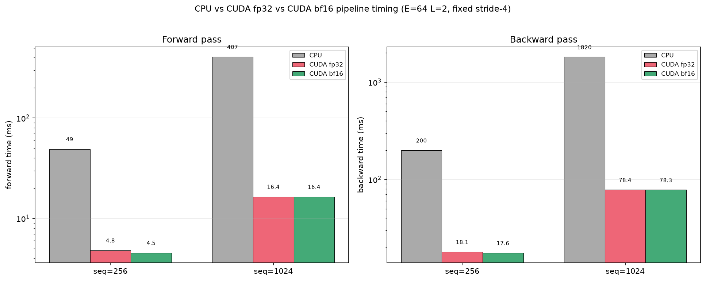

# Benchmarks

Inference verification on the 7.8M-parameter TinyStories BLT-D checkpoint (embed=256, hidden=512,
2 encoder / 6 global / 2 decoder layers, 600k steps, AdamW, `block_size=4`, entropy patching).

## Headline finding

**At this scale BLT-DV is a net win, but only at the trained block size.** At `B=4`, with the
entropy LM the model was trained with, BLT-DV accepts 65% of drafted bytes and produces output
byte-identical to greedy, at 0.85x the memory bandwidth and 0.89x the wall-clock of greedy
(350 ms vs 394 ms per 64-byte prompt). Adaptive-B, which starts at `B=8` and backs off, recovers
most of that: 35.2% acceptance at 0.99x bandwidth.

Every configuration at `B=8` or above loses badly, because block cells past the trained `B` form a
bidirectional block that L_mask never supervised. BLT-S (self-speculation) is a net loss at every
window size tested. So the honest summary is: verified speculation helps at this scale only where
the draft matches what the model was trained to draft.

## Setup

| | |
|---|---|
| Checkpoints | `runs/tinystories_600k/tinystories_600k.fblt` (7.83M params), `runs/tinystories_300k/tinystories_paper_360k.fblt` |
| Entropy LM | `runs/entropylm/entropy_lm.fblt` (required, see below) |
| Corpus | TinyStories, 171.6 MB train (`data/tinystories/train.bin`), 9.1 MB held out (`data/tinystories/heldout.bin`) |
| Prompts | 8 held-out prompts at offsets `200000 + p*100000`, 64 bytes each, 64 new bytes |
| Quality metrics | causal BPB, masked-cell accuracy |
| Speed metrics | NFE/byte, bandwidth (Eq. 8), wall-clock |

### Passing the entropy LM is not optional

`--entropy-lm` is **required** whenever entropy patching is used. A random-init entropy LM puts
per-byte entropy near `ln(256) = 5.54`, above the 2.5 patch threshold at every position, so every
byte starts its own patch and the model runs on an all-1-byte-patch layout it never saw in
training. `bin/infer` and `infer_bench` both fail hard rather than measure this; `--fixed-patches`
is the one legitimate case that needs no LM.

## Model quality

Two checkpoints from the same run, evaluated on the held-out split
(`train_blt_d --steps 0 --eval-windows 200`, 102,400 bytes):

| checkpoint | causal BPB (held out) |
|---|---:|
| 30k probe | 1.7536 |
| 360k | 1.1611 |
| 600k | **0.9978** |

Quality improves monotonically with training. There is no overfitting: the whole 600k-step run is
1.07 epochs over 171.6 MB, so the model has seen each byte roughly once.

## Inference methods

| Method | How it generates | Cost |
|---|---|---|
| **greedy** (baseline) | one full encoder+global+decoder forward per byte | 1.0 enc and 1.0 dec NFE/byte |
| **BLT-S** (self-speculation) | draft k bytes decoder-only, verify all k with one full forward, accept the longest matching prefix | more decoder NFEs, fewer encoder NFEs |
| **BLT-D** (block diffusion) | start a block of B masked positions, iteratively unmask the most confident ones | cheapest per byte, output diverges from greedy |
| **BLT-DV** (diffusion + verification) | BLT-D drafts, then a causal forward verifies them like BLT-S | output identical to greedy; cheap only when acceptance is high |

## Results

### Bandwidth analysis (Eq. 8)

Memory bandwidth = `b * [N_dec * P_dec + N_enc * (P_enc + P_glob)] / 10^9` GB with `b=2` (fp16).

For this checkpoint, `P_dec = 1,967,872` and `P_enc + P_glob = 5,862,912`, giving a greedy baseline
of **15.66 MB/byte**. Both counts come from `blt_model_visit_params` using the visitor's
`is_dec` / `is_enc || is_glob` flags. (The method reproduces the previously published 2.97M
constants exactly, which is how it was validated.)

#### Entropy patching (default)

| Method | dec/byte | enc/byte | acceptance | agree | BW (MB) | BW vs greedy |
|---|---:|---:|---:|---:|---:|---:|
| greedy | 1.000 | 1.000 | – | 1.000 | 15.66 | 1.000x |
| selfspec k=4 | 2.336 | 0.957 | 28.0% | 1.000 | 20.42 | 1.304x |
| selfspec k=8 | 4.074 | 0.957 | 14.5% | 1.000 | 27.26 | 1.740x |
| selfspec k=16 | 7.189 | 0.957 | 7.7% | 1.000 | 39.52 | 2.523x |
| blockdiff B=4 | 0.838 | 0.508 | – | 0.182 | 9.25 | 0.591x |
| blockdiff B=8 | 0.908 | 0.400 | – | 0.150 | 8.27 | 0.528x |
| blockdiff B=16 | 0.906 | 0.240 | – | 0.135 | 6.38 | 0.408x |
| **blockdv B=4** | **1.043** | **0.787** | **65.0%** | **1.000** | **13.33** | **0.851x** |
| blockdv B=8 | 2.045 | 1.031 | 10.8% | 1.000 | 20.14 | 1.286x |
| blockdv B=16 | 3.283 | 1.055 | 4.9% | 1.000 | 25.29 | 1.615x |
| blockdv onestep (B=8) | 1.109 | 1.109 | 5.6% | 1.000 | 17.37 | 1.109x |
| blockdv eb γ=1.0 (B=8) | 2.145 | 1.031 | 10.9% | 1.000 | 20.53 | 1.311x |
| blockdv eb γ=2.0 (B=8) | 2.004 | 1.033 | 10.8% | 1.000 | 20.00 | 1.277x |
| blockdiff eb (B=8) | 0.984 | 0.357 | – | 0.113 | 8.07 | 0.515x |
| blockdv hetv (B=8) | 2.045 | 1.031 | 10.8% | 1.000 | 20.14 | 1.286x |
| blockdv boundary-aligned (B=8) | 2.219 | 1.082 | 16.8% | 1.000 | 21.42 | 1.368x |
| blockdv adaptive (from B=8) | 1.359 | 0.861 | 35.2% | 1.000 | 15.45 | 0.986x |
| blockdv adaptive + aligned | 1.385 | 0.846 | 36.9% | 1.000 | 15.37 | 0.981x |

Raw BLT-D (`blockdiff`) is the cheapest thing here at 0.41-0.59x bandwidth, but its output
diverges from greedy: agreement is only 0.135-0.182, so it is not a drop-in substitute.

### Wall-clock latency

Mean ms per prompt, 64 new bytes, 8 prompts, RTX 4060.

| Method | entropy patching | fixed-stride-4 |
|---|---:|---:|
| greedy | 394 | 424 |
| selfspec k=4 | 504 | 515 |
| selfspec k=16 | 950 | 986 |
| blockdiff B=4 | 251 | 197 |
| **blockdv B=4** | **350** | 479 |
| blockdv B=8 | 551 | 626 |
| blockdv B=16 | 720 | 861 |
| blockdv adaptive | 408 | 500 |

BLT-DV at `B=4` is the only verified method that beats greedy on both bandwidth and wall-clock.
Wall-clock is not a clean comparison across methods since KV-cache usage and encoder passes
differ, but the direction matches the NFE counts.


*Drafted-byte acceptance by method. BLT-DV at the trained `B=4` leads at 65%; everything at
`B>=8` collapses because those block cells were never supervised by L_mask.*


*Decoder NFEs/byte against agreement with greedy. `blockdv B=4` sits below and left of greedy:
fewer encoder passes and slightly more decoder passes, for identical output.*


*Encoder and decoder NFEs per byte. Verified methods trade encoder passes for decoder passes.*


*Mean wall-clock ms per prompt (64 new bytes).*

## Acceptance vs the paper

The Fast-BLT paper reports acceptance at 1B-3B params on FR→EN translation. This is 7.8M params on
English story prose, so both scale and domain differ, and the gap below is not attributable to
either alone.

| Config | Paper 3B (FR→EN) | This repro (7.8M, TinyStories) |
|---|---:|---:|
| B=4 | 94.4% | **65.0%** |
| B=8 | 86.3% | 10.8% |
| B=16 | 67.2% | 4.9% |
| B=8, one-step | 84.6% | 5.6% |

**BLT-S acceptance (no paper-comparable B axis):**

| k | This repro |
|---|---:|
| 4 | 28.0% |
| 8 | 14.5% |
| 16 | 7.7% |

`B=4` is the only setting where the two are in the same regime, and there the model reaches 65%
against the paper's 94.4%. The `B=8` and `B=16` rows are not a scale result: the model was
trained at `B=4`, so those rows measure a train/inference mismatch, not a capability limit. A
`B=8` comparison would need a model trained at `B=8`.

## Entropy vs fixed-stride patching

| Patching | blockdv B=4 acceptance | agree | BW vs greedy |
|---|---:|---:|---:|
| Entropy (matches training) | **65.0%** | 1.000 | 0.851x |
| Fixed-stride-4 | 28.7% | 1.000 | 1.107x |

Entropy patching more than doubles acceptance and is the difference between BLT-DV being cheaper
than greedy and being more expensive. This model was trained with entropy patching, so fixed-stride
commit points land mid-patch and every draft byte has to be re-verified.

Note that with fixed-stride patching `blockdiff` agreement drops to 0.088-0.115, versus 0.135-0.182
with entropy patching.

## What changed from the previous numbers

The previous version of this document reported BLT-DV acceptance of 1.6-5.2% and concluded that
"acceptance at this scale is 18-42x lower than the paper, root cause likely the 340x scale gap".
That conclusion was wrong, and the numbers were measuring a broken configuration rather than the
model.

`bench/infer_bench.c` defaulted `--entropy-lm` to NULL, which builds a random-init entropy LM, so
every byte became its own patch. The old rows are still in `bench/results.jsonl` under phase
`6_infer` and match the old tables digit for digit (`bltd_blockdv_B4_a0.70` = 0.0523). Re-running
the same checkpoint with its trained entropy LM gives 0.650.

Two code bugs also contributed and are fixed in PRs #26 (draft pass cross-attended a stale latent
for the patch-closing byte) and #29 (inference defaulted `--block-size` to 8 against a model
trained at 4). Both `bin/infer` and `infer_bench` now hard-fail on a missing entropy LM.

The old checkpoint (`s101.fblt`, 2.97M params) no longer exists, so those specific numbers can
never be re-verified bit-for-bit. This section reports the checkpoint that does exist.

## Reproducing

Build and run:

```bash
cmake -S . -B build-cuda -DUSE_CUDA=ON
cmake --build build-cuda --target infer_bench -j$(nproc)

source scripts/cuda_env.sh   # WSL2 only

./build-cuda/infer_bench --backend cuda \
  --plain runs/tinystories_600k/tinystories_600k.fblt \
  --bltd runs/tinystories_600k/tinystories_600k.fblt \
  --entropy-lm runs/entropylm/entropy_lm.fblt \
  --heldout data/tinystories/heldout.bin \
  --embed 256 --hidden 512 --enc-layers 2 --glob-layers 6 --dec-layers 2 --cross-attn all \
  --prompts 8 --new-bytes 64 \
  --results bench/results_tinystories_10m.jsonl
```

Add `--fixed-patches` for the fixed-stride comparison. `--entropy-lm` and the shape flags are both
mandatory: without them the tool aborts rather than measure a model on a layout it never saw.

Held-out quality:

```bash
./build-cuda/train_blt_d --corpus data/tinystories/train.bin \
  --load-weights runs/tinystories_600k/tinystories_600k.fblt --steps 0 \
  --embed 256 --hidden 512 --enc-layers 2 --glob-layers 6 --dec-layers 2 \
  --entropy-lm runs/entropylm/entropy_lm.fblt --entropy-patches \
  --eval-corpus data/tinystories/heldout.bin --eval-windows 200 --backend cuda
```

Plots:

```bash
pip install matplotlib
python fblt/scripts/bench_plots.py --results bench/results_tinystories_10m.jsonl --out graphs
```

Raw measurements are committed at `bench/results_tinystories_10m.jsonl` (44 rows, phase
`6_infer`). `bench/results.jsonl` is gitignored and holds the full untracked history, including the
superseded broken-configuration run.

## CUDA benchmarks

All numbers from `bench/cuda_bench` on a **desktop NVIDIA GeForce RTX 4060** (AD107, 3072 fp32 cores, 115 W, 8188 MiB GDDR6, driver 616.56). CPU baseline is **single-threaded naive loops** (no OpenMP, no BLAS so really weak).

### Hardware identification

| | |
|---|---|
| GPU | NVIDIA GeForce RTX 4060 (AD107, CC 8.9) |
| VRAM | 8188 MiB GDDR6 |
| Power | 115 W |
| Max SM clock | 3105 MHz |
| fp32 peak (NVIDIA spec) | 15.11 TFLOP/s (3072 cores × 2460 MHz boost × 2) |
| Harness constant (corrected) | 15.11 TFLOP/s (`cuda_bench.c`) |

### Micro benchmarks (bench config: E=64, H=128, L=2)

Pure-op throughput, 3 runs averaged.

| Op | Size | CUDA (mean) | Unit |
|---|---|---|---|---|
| fp32 matmul | 512×512 | 5.87 | TFLOP/s |
| fp32 matmul | 1024×1024 | 6.77 | TFLOP/s | |
| fp32 matmul | 2048×2048 | 6.57 | TFLOP/s | |
| bf16 matmul | 512×512 | 11.2 | TFLOP/s |
| bf16 matmul | 1024×1024 | 18.73 | TFLOP/s | |
| bf16 matmul | 2048×2048 | 20.48 | TFLOP/s | |

fp32 matmul range: 5.87–6.77 TFLOP/s across sizes. bf16/fp32 ratio ranges from 1.9x (512) to 3.1x (2048).

### Meso benchmarks (bench config: E=64, L=2, full forward+backward pipeline)

All times in milliseconds (ms), 3 runs averaged.

| Config | Size | fwd (ms) | bwd (ms) |
|---|---|---|---|
| fp32 | 256 tokens | 4.28 | 15.76 |
| fp32 | 1024 tokens | 13.75 | 62.07 |
| bf16 | 256 tokens | 4.13 | 15.65 |
| bf16 | 1024 tokens | 13.68 | 62.11 |


*CPU vs CUDA fp32 vs CUDA bf16 pipeline timing (E=64, H=128, L=2, fixed stride-4 patching). Seq=256: ~10x speedup. Seq=1024: ~24x speedup. Values averaged across multiple benchmark runs.*

### Macro benchmarks, training cell and generation cell

`macro_training_cell`: embed + 2×matmul + layernorm + SwiGLU + add (one full decoder layer, fwd+bwd). `macro_generation_cell`: autoregressive byte generation with KV-cache (naive greedy, 48-byte window). Both measured with `--iters 10`, 3 runs.

The training cell is synthetic and needs no checkpoint. The generation cell does load one, and its
default `--ckpt` path (`runs/followup1_base_s104.fblt`) no longer exists in this repo, so these rows
cannot be reproduced as-is. Its shape is hardcoded to E=192 / H=384 / 2-2-2 with no shape flags, so
it also cannot load the 7.8M TinyStories checkpoint. Any checkpoint of that shape works, since the
measurement is timing-only and weight-independent.

#### Bench config (E=64, H=128)

| Metric | CUDA (mean) | CPU (mean) | Speedup |
|---|---|---|---|
| macro_train_1024 (tokens/s) | 14,872 | 496 | **30.0x** |
| macro_gen_greedy (passes/s) | 221.7 | 6.3 | **35.2x** |

#### Production config (E=192, H=384, 2.97M params)

| Metric | CUDA (mean) | CPU (mean) | Speedup |
|---|---|---|---|
| macro_train_1024 (tokens/s) | 7,024 | 93 | **75.8x** |
| macro_gen_greedy (passes/s) | 217.7 | 6.3 | **34.4x** |

Per-run raw data (production config):

| Run | CUDA train | CUDA gen | CPU train | CPU gen |
|---|---:|---:|---:|---:|
| 1 | 7,004 | 216.2 | 92 | 6.3 |
| 2 | 7,005 | 222.4 | 93 | 6.3 |
| 3 | 7,062 | 214.5 | 93 | 6.4 |

Training speedup scales with model size (30x → 76x from E=64 to E=192) because the larger model better saturates GPU cores. Generation speedup stays flat (~34-35x).

### MFU analysis

| Metric | Value | Against |
|---|---|---|
| fp32 matmul mean (512/1024/2048) | 6.40 TFLOP/s | |
| **fp32 MFU** | **42.4%** | Desktop RTX 4060 spec peak (15.11 TFLOP/s) |
| bf16 matmul (1024+2048 avg) | 19.61 TFLOP/s | Tensor-core path |
| bf16/fp32 ratio at 512 | 1.9x | |
| bf16/fp32 ratio at 1024 | 2.8x | |
| bf16/fp32 ratio at 2048 | 3.1x | |
